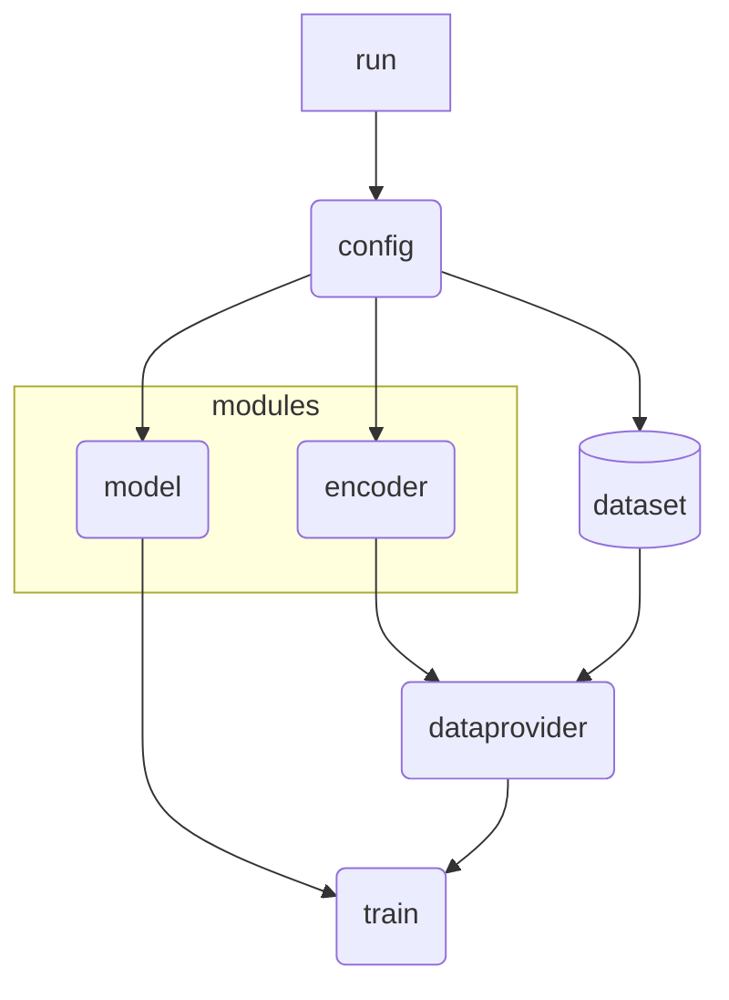

# Structure-informed Prediction of Xenotransplantation Immunogenicity


## Introduction

The global demand for organ transplantation is steadily increasing, yet the limited availability of donor organs results in many patients not receiving necessary transplants, leading to increased mortality rates. Xenotransplantation, the transplantation of organs from different species, has emerged as a promising alternative to address this shortage. However, a significant challenge in xenotransplantation is managing the immune response that can lead to transplant rejection.

While deep learning technologies are actively being explored for predicting immunogenicity, research specifically focused on xenotransplantation immunogenicity remains limited. This study aims to bridge this gap by leveraging advanced structure-based deep learning techniques to identify protein structures that may trigger immune responses during xenotransplantation. Our goal is to enhance the success rate of xenotransplants by preemptively predicting and mitigating potential immunogenic reactions.

## Notice

**Important:** This repository does not include model weights and embeddings due to their large size.

## Workflow



## How to Run

### Configuration

1. **Edit Configuration File:**
   - Open the `config.py` file located in the root directory.
   - By default, it imports `model.py` and `encoder.py` from the `code` directory.
   - To use custom models or encoders, place your `model.py` and `encoder.py` in your working directory and update the import paths in `config.py` accordingly.

### Running the Code

You can execute the code using one of the following methods:

#### 1. Using the Terminal
Run the shell script:
```bash
bash run.sh
```

Alternatively, run the training script directly:
```bash
python path/to/code/train.py path/to/config.py
```

#### 2. Programmatically in Python
Import and run the training function within a Python script or interactive session(jupyter notebook):
```python
from code.train import main as train
train('path/to/config.py')
```

## Configuration Argument Examples

| Argument    | Description                                                                                                                                                            |
|-------------|------------------------------------------------------------------------------------------------------------------------------------------------------------------------|
| `model`     | Select a specific class from `model.py` to define the model architecture.                                                                                             |
| `encoder`   | Select a specific class from `encoder.py` to define the encoding strategy for input data.                                                                              |
| `epi_args`  | Arguments for the epitope dataset. Configure the header names for epitope sequences, HLA names, and targets in the dataset file. Specify the separator used in the dataset (e.g., `,` or `\t`). |

## License

This project is licensed under the [MIT License](LICENSE).

## Contact

For any questions or feedback, please contact [hwjang00@snu.ac.kr](mailto:hwjang00@snu.ac.kr).